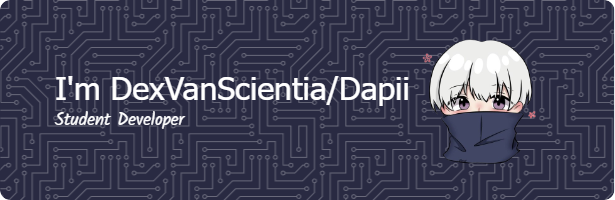

# Hello, I'm Dapii!
I'm a **student** and a **beginner programmer** who is currently learning the basics of coding and building small projects.

## 🚀 About Me:

- 🎓 Still a student
- 💻 Currently learning: HTML, CSS, JavaScript, and Python
- 🌱 Interested in: Web Development & GitHub
- 📚 I love exploring and trying out new tech

## 💻 Tech Stack:
                 

## 🏆 GitHub Trophies:

## 🎮 Play Games:
<picture>
  <source media="(prefers-color-scheme: dark)" srcset="https://raw.githubusercontent.com/DexVanScientia/DexVanScientia/output/pacman-contribution-graph-dark.svg">
  <source media="(prefers-color-scheme: light)" srcset="https://raw.githubusercontent.com/DexVanScientia/DexVanScientia/output/pacman-contribution-graph.svg">
  
</picture>
